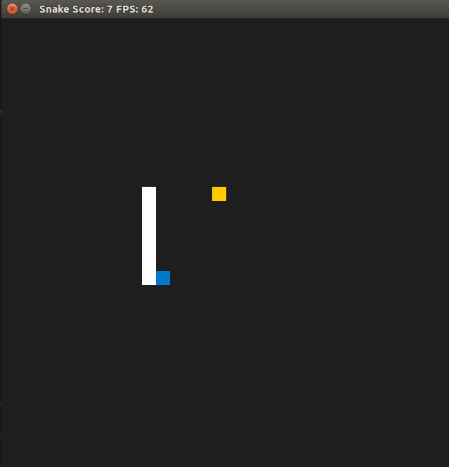

# CPPND: Capstone Snake Game Example

This is a repo for the Capstone project in the [Udacity C++ Nanodegree Program](https://www.udacity.com/course/c-plus-plus-nanodegree--nd213). The code for this repo was inspired by [this](https://codereview.stackexchange.com/questions/212296/snake-game-in-c-with-sdl) excellent StackOverflow post and set of responses.

The Capstone Project gives you a chance to integrate what you've learned throughout this program. This project will become an important part of your portfolio to share with current and future colleagues and employers.

In this project, you can build your own C++ application or extend this Snake game, following the principles you have learned throughout this Nanodegree Program. This project will demonstrate that you can independently create applications using a wide range of C++ features.

## Dependencies for Running Locally
* cmake >= 3.7
  * All OSes: [click here for installation instructions](https://cmake.org/install/)
* make >= 4.1 (Linux, Mac), 3.81 (Windows)
  * Linux: make is installed by default on most Linux distros
  * Mac: [install Xcode command line tools to get make](https://developer.apple.com/xcode/features/)
  * Windows: [Click here for installation instructions](http://gnuwin32.sourceforge.net/packages/make.htm)
* SDL2 >= 2.0
  * All installation instructions can be found [here](https://wiki.libsdl.org/Installation)
  >Note that for Linux, an `apt` or `apt-get` installation is preferred to building from source. 
* gcc/g++ >= 5.4
  * Linux: gcc / g++ is installed by default on most Linux distros
  * Mac: same deal as make - [install Xcode command line tools](https://developer.apple.com/xcode/features/)
  * Windows: recommend using [MinGW](http://www.mingw.org/)

## Basic Build Instructions

1. Clone this repo.
2. Make a build directory in the top level directory: `mkdir build && cd build`
3. Compile: `cmake .. && make`
4. Run it: `./SnakeGame`.

## New Features Added

* Pause and Resume with `Esc` key
* Quit the game with `Q` key
* Added a menu to control the flow of the application
* Storage of scores and the possibility of accessing them through the menu
* Toxic food mode - You can eat ramdonly a food that changes you your controllers, for example if you try to move up you go down
* Hard mode - Every 5 seconds the food change its position

## Rubric Points

#### README

| Success Criteria  | Explanation and address |
| ------------- | ------------- |
| A README with instructions is included with the project  | README.md |
| The README indicates the new features you added to the game.  | README.md  - New Features Added|
| The README includes information about each rubric point addressed. | README.md  - Rubric Points|

#### Compiling and Testing

| Success Criteria  | Explanation and address |
| ------------- | ------------- |
| The submission must compile and run without errors on the Udacity project workspace.  | OK  |

#### Loops, Functions, I/O

| Success Criteria  | Explanation and address |
| ------------- | ------------- |
| The project demonstrates an understanding of C++ functions and control structures.  | All code added  |
| The project reads data from a file and process the data, or the program writes data to a file.  | `scores.cpp` - loadScores() and saveScores()  |
| The project accepts user input and processes the input. | `controller.cpp` - Added the new input reads like `Q` and `Esc`  |
| The project uses data structures and immutable variables.  | All code added - Also trying to follow the SOLID principles |

#### Object Oriented Programming

| Success Criteria  | Explanation and address |
| ------------- | ------------- |
| One or more classes are added to the project with appropriate access specifiers for class members. | `scores.h`, `menu.h `|
| Class constructors utilize member initialization lists.  | `snake.h`  |
| Classes abstract implementation details from their interfaces.  | All header files  |
| Overloaded functions allow the same function to operate on different parameters.  | `snake.h` - UpdateBody function |

#### Memory Management

| Success Criteria  | Explanation and address |
| ------------- | ------------- |
| The project makes use of references in function declarations.  | `scores.h`, `snake.h` (line 16), `score.h` |
| The project uses destructors appropriately.  | In `renderer.h` the destructor is used to close and removed all the memory after the game ends |
| The project uses scope / Resource Acquisition Is Initialization (RAII) where appropriate  | `scores.cpp`  |
| The project uses smart pointers instead of raw pointers.  | `scores.cpp`  |

#### Concurrency

| Success Criteria  | Explanation and address |
| ------------- | ------------- |
| The project uses multithreading.  | `game.cpp`  |
| A mutex or lock is used in the project.  | `game.cpp`  |
| A condition variable is used in the project.  | `game.cpp` |
